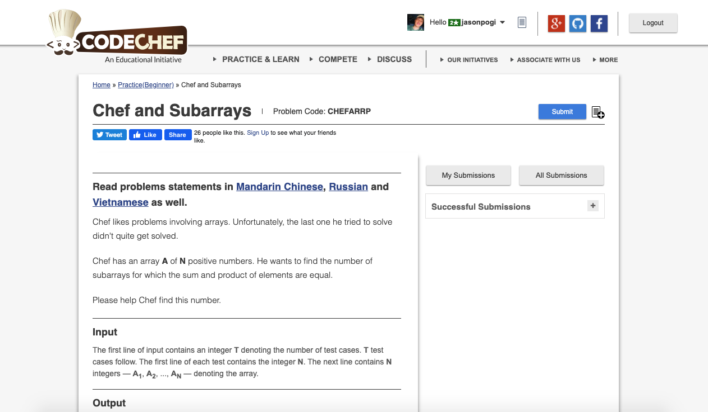

# Codechef-Chef-and-Subarrays
### Problem

### Program Simulation
<pre>
  Sample Input: 1 3 2

  n = 3

  i = 0
  s = 0
  p = 1
  j = 0 *until index n - 1
  s += a[0] // 0 + 1 = 1
  s = 1
  p *= a[0] // 1 * 1 = 1
  if(s == p) // true
  cnt++
  cnt = 1
  j = 1
  s += a[1] // 1 + 3 = 4
  s = 4
  p *= a[1] // 1 * 3 = 3
  p = 3
  if (s == p) // false
  j = 2
  s += a[2] // 4 + 2 = 6
  s = 6
  p *= a[2] // 3 * 2 = 6
  p = 6
  if(s == p) // true
  cnt++
  cnt = 2

  i = 1
  s = 0
  p = 1
  j = 1 *until index n - 1
  s += a[1] // 0 + 3 = 3
  s = 3
  p *= a[1] // 1 * 3 = 3
  p = 3
  if(s == p) // true
  cnt++
  cnt = 3
  j = 2
  s += a[2] // 3 + 2 = 5
  s = 5
  p *= a[2] // 3 * 2 = 6
  p = 6
  if(s == p) // false

  i = 2
  s = 0
  p = 1
  j = 2 *until index n - 1
  s += a[2] // 0 + 2 = 2
  s = 2
  p *= a[2] // 1 * 2 = 2
  p = 2
  if(s == p) // true
  cnt++
  cnt = 4

  print cnt

  Final Output:
  4
  

  Sample Input: 4 1 2 1

  n = 4

  i = 0
  s = 0
  p = 1
  j = 0 *until n - 1
  s += a[0] // 0 + 4 = 4
  s = 4
  p *= a[0] // 1 * 4 = 4
  p = 4
  if(s == p) // true
  cnt++
  cnt = 1
  j = 1
  s += a[1] // 4 + 1 = 5
  s = 5
  p *= a[1] // 4 *1 = 4
  p = 4
  if(s == p) // false
  j = 2
  s += a[2] // 5 + 2 = 7
  s = 7
  p *= a[2] // 4 * 2 = 8
  p = 8
  if(s == p) // false
  j = 3
  s += a[3] // 7 + 1 = 8
  s = 8
  p *= a[3] = // 8 * 1 = 8
  p = 8
  if(s == p) // true
  cnt++
  cnt = 2

  i = 0
  s = 0
  p = 1
  j = 1 *until n - 1
  s += a[1] // 0 + 1 = 1
  s = 1
  p *= a[1] // 1 * 1 = 1
  p = 1
  if(s == p) // true
  cnt++
  cnt = 3
  j = 2
  s += a[2]  // 1 + 2 = 3
  s = 3
  p *= a[2] // 1 * 2 = 2
  p = 2
  if(s == p) // false
  j = 3
  s += a[3] // 3 + 1 = 4
  s = 4
  p *= a[3] // 2 * 1 = 2
  p = 2
  if(s == p) // false

  i = 0
  s = 0
  p = 1
  j = 2 *until n - 1
  s += a[2] // 0 + 2 = 2
  s = 2
  p *= a[2] // 1 * 2 = 2
  p = 2
  if(s == p) // true
  cnt++
  cnt = 4
  j = 3
  s += a[3] // 2 + 1 = 3
  s = 3
  p *= a[3] // 2 * 1 = 2
  p = 2 
  if(s == p) // false

  i = 0
  s = 0
  p = 1
  j = 3 *until n - 1
  s += a[3] // 0 + 1 = 1
  s = 1
  p *= a[3] = 1 * 1 = 1
  if(s == p) // true
  cnt++
  cnt = 5

  print cnt

  Final Output"
  5
</pre>
